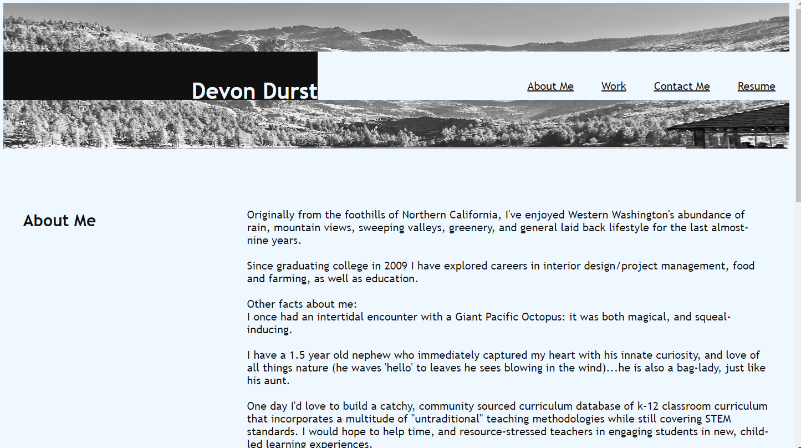
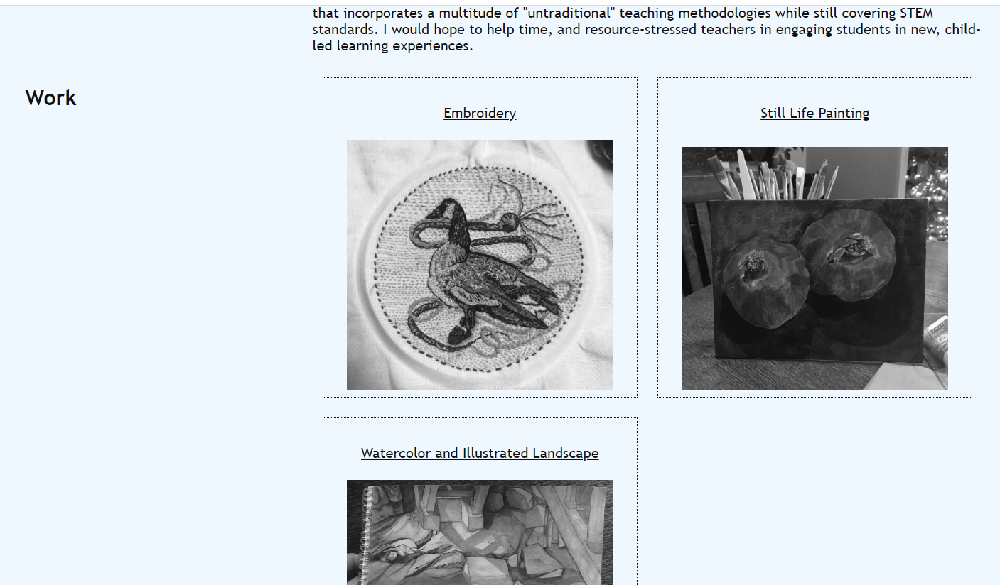
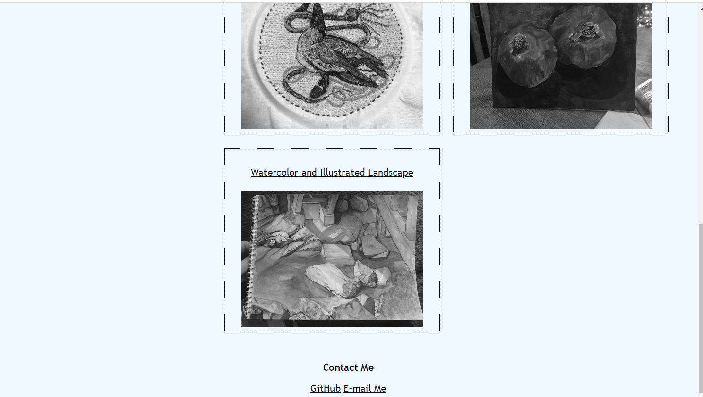

# Personal Webpage

## Description and usage
This website was built to house my ever-evolving portfolio with easily accessible contact information as well as some basic information about myself-- a get-to-know-me if you will. 
My web development projects are still evolving, and so I used this website to show my art until I have web dev projects to display. 

I used semantic HTML, and concise, streamlined CSS layout to make updating clear, and easy. 

## Media Query
I designed this to work well with a traditional computer monitor, with addition media query styling to adapt to smaller tablet, and phone screens (since most web users acess content via a phone or tablet).

Using a flexbox layout throughout made adapting my css styling clear since I knew I was mostly going to need to focus on width percentages, and positioning with 'justify-content'. 

## Web links
Github Repository: https://github.com/D-Dursty/devon-durst-personal-webpage

Live Link: https://d-dursty.github.io/devon-durst-personal-webpage/ 

## Screenshots

## License 
Please refer to the repository license

Built with excitement, frustration, a small meltdown, curiosity, friendship, HTML, and CSS by Devon Durst, September 2022. 